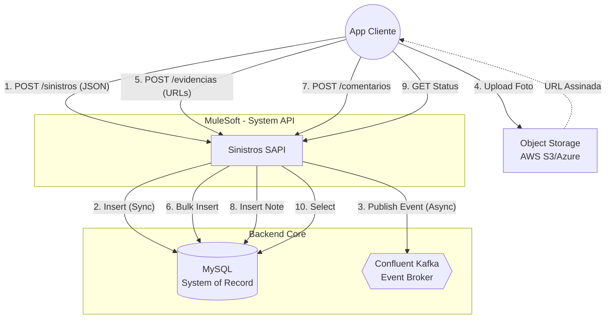

# 🚀 PFM Porto - MuleSoft Architecture Training
### Auto Claims Ingestion System (Sistema de Ingestão de Sinistros)


Este repositório contém o código-fonte, especificações de API (RAML) e scripts de infraestrutura desenvolvidos durante o treinamento técnico **PFM Porto**.

O projeto simula uma **System API** robusta para o ecossistema de Seguros Auto, demonstrando a transição de uma arquitetura legada (Ponto-a-Ponto) para uma arquitetura moderna baseada em **API-led Connectivity** e **Event-Driven Architecture (EDA)**.

---

## 🏗️ Arquitetura da Solução

O sistema adota uma arquitetura **Híbrida (Síncrona/Assíncrona)** para garantir alta disponibilidade na ingestão e consistência imediata na gestão do ciclo de vida do sinistro.

### Diagrama de Fluxo (V2)



### Componentes Chave

| Componente | Função | Padrão Utilizado |
| --- | --- | --- |
| **MuleSoft (System API)** | Orquestrador e Guardião da entrada. Valida contratos e roteia dados. | *API-led Connectivity* |
| **MySQL** | Fonte da Verdade (System of Record). Garante a persistência relacional. | *Transactional Storage* |
| **Confluent Kafka** | Desacopla a ingestão do processamento pesado (Fraude, Guincho). | *Event-Driven (EDA)* |
| **Object Storage** | Armazena os binários (fotos/docs). A API manipula apenas as URLs. | *Claim-Check Pattern* |

---

## 🛠️ Tecnologias Utilizadas

* **Linguagem de Especificação:** RAML 1.0 (RESTful API Modeling Language)
* **Transformação de Dados:** DataWeave 2.0
* **Runtime:** Mule 4.4+ (Java 8/11/17)
* **Banco de Dados:** MySQL 8.0 (Rodando via Docker)
* **Mensageria:** Apache Kafka (Confluent Cloud)
* **Ferramentas:** Anypoint Studio, DBeaver, Postman.

---

## 📚 Funcionalidades da API

A API foi desenhada seguindo os princípios RESTful e suporta os seguintes recursos:

### 1. Ingestão de Sinistros

* **Endpoint:** `POST /sinistros`
* **Descrição:** Recebe os dados do acidente, valida (Regex Placa/Apólice), grava no banco e dispara evento Kafka.
* **Retorno:** Protocolo gerado imediatamente.

### 2. Gestão de Evidências (V2)

* **Endpoint:** `POST /sinistros/{id}/evidencias`
* **Descrição:** Recebe um lote (Array) de URLs de fotos/documentos.
* **Técnica:** Utiliza *Bulk Insert* para alta performance.
* **Endpoint:** `GET /sinistros/{id}/evidencias` (Listagem de arquivos enviados).

### 3. Comentários e Interações (V2)

* **Endpoint:** `POST /sinistros/{id}/comentarios`
* **Descrição:** Permite adicionar notas de texto ao processo (Ex: Cliente avisa sobre local das chaves).
* **Técnica:** Persistência síncrona simples.

### 4. Consultas

* **Endpoint:** `GET /sinistros/{id}`
* **Descrição:** Permite ao cliente acompanhar o status em tempo real (Leitura direta do banco).

---

## 🚀 Como Executar o Projeto

### Pré-requisitos

* [Anypoint Studio](https://www.mulesoft.com/platform/studio) instalado.
* [Docker Desktop](https://www.docker.com/) instalado e rodando.
* Credenciais da Confluent Cloud (Kafka) configuradas no `config.yaml`.

### Passo 1: Subir a Infraestrutura (Docker)

Execute o comando abaixo na raiz da pasta `docker` para subir o MySQL:

```bash
docker-compose up -d

```

### Passo 2: Criar as Tabelas

Conecte-se ao banco via DBeaver (Porta 3306) e rode o script inicial:

```sql
-- Tabela Principal
CREATE TABLE tb_sinistro (
    id INT AUTO_INCREMENT PRIMARY KEY,
    protocolo VARCHAR(50) UNIQUE,
    status VARCHAR(20),
    data_criacao DATETIME DEFAULT CURRENT_TIMESTAMP
);

-- Tabela de Evidências
CREATE TABLE tb_evidencia (
    id INT AUTO_INCREMENT PRIMARY KEY,
    sinistro_id INT, -- FK
    tipo VARCHAR(50),
    url_arquivo VARCHAR(255),
    FOREIGN KEY (sinistro_id) REFERENCES tb_sinistro(id)
);

-- Tabela de Comentários
CREATE TABLE tb_comentario (
    id INT AUTO_INCREMENT PRIMARY KEY,
    sinistro_id INT, -- FK
    mensagem TEXT,
    autor VARCHAR(50),
    data_criacao DATETIME DEFAULT CURRENT_TIMESTAMP,
    FOREIGN KEY (sinistro_id) REFERENCES tb_sinistro(id)
);

```

### Passo 3: Configurar e Rodar

1. Importe o projeto no Anypoint Studio.
2. Edite o arquivo `src/main/resources/config.yaml` com as credenciais do seu Kafka e Banco de Dados.
3. Clique com botão direito no projeto -> **Run As** -> **Mule Application**.

---

## 📂 Estrutura do Projeto

```
/
├── src/
│   ├── main/
│   │   ├── mule/               # Fluxos XML (Implementation)
│   │   │   ├── global.xml      # Configurações globais (HTTP, DB, Kafka)
│   │   │   ├── interface.xml   # APIkit Router e fluxos gerados
│   │   │   └── implementation/ # Lógica de negócio separada
│   │   └── resources/
│   │       ├── api/            # Especificação RAML
│   │       │   ├── dataTypes/  # Fragmentos de dados
│   │       │   └── ...
│   │       └── config.yaml     # Variáveis de ambiente
├── docker/                     # Arquivos docker-compose
└── README.md                   # Documentação

```

---

## 🧪 Exemplos de Payload (Para Teste)

**1. Criar Sinistro:**

```json
{
  "apolice": "8899776655",
  "placaVeiculo": "ABC1D23",
  "descricaoOcorrencia": "Colisão traseira."
}

```

**2. Adicionar Comentário:**

```json
{
  "mensagem": "Deixei a chave do veiculo com o guincheiro.",
  "autor": "CLIENTE"
}

```

**3. Enviar Evidências:**

```json
[
  {
    "tipo": "FOTO_VEICULO",
    "urlArquivo": "[https://s3.aws.com/foto1.jpg](https://s3.aws.com/foto1.jpg)"
  }
]

```

---

## 👨‍💻 Autores e Instrutores

* **Lucas Oliveira** - *Desenvolvedor e responsável pelo material*
* **Lucas Fabiano** - *Arquiteto de integrações & Instrutor*
* **Lucas Oliveira** - *Arquiteto de Soluções & Instrutor*
* **Equipe PFM Porto** - *Time de Desenvolvimento*

---

*Este projeto é parte do material didático da Consultoria OrangeDoor para a Porto.*

```

```
